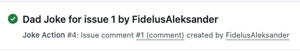

## Step 6: Trigger & Validate

Awesome! :rocket: You've created the Dad Jokes GitHub Action, defined its metadata, and authored a workflow to use it.

The only thing left to do is test it out!

### ⌨️ Activity: Try out your action

1. Create a comment in this issue (or create a new issue) with the text `/joke`

1. Monitor the **Actions** tab for the `Joke Action` workflow to complete:

   

1. Return to the issue and you should see a new comment posted by `github-actions[bot]` containing a random dad joke!

1. Mona will post the exercise review once your new Dad Joke workflow completes **successfully**! 

   

   
Having trouble? 🤷
 

   If the workflow doesn't trigger or fails:
   - Make sure your comment starts exactly with `/joke`
   - Check the Actions tab for error messages
   - Verify that your `dist/index.js` file exists and was committed
   - If you did any updates to your source code, ensure you re-bundled with `npm run build` and pushed the changes
   - Ensure your `action.yml` file is correctly formatted

   

